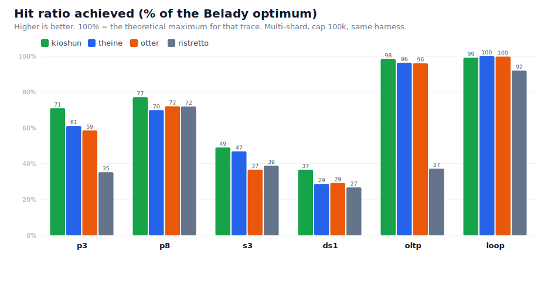
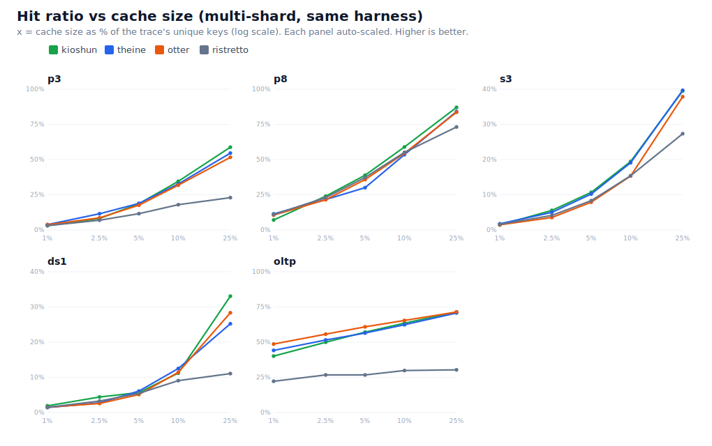
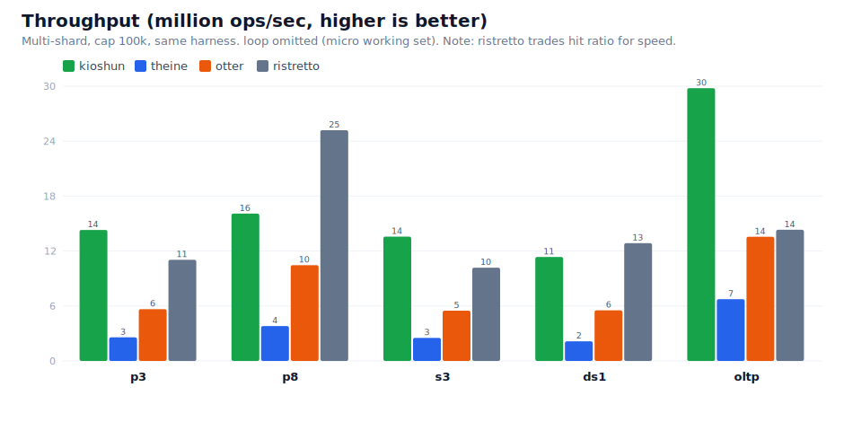
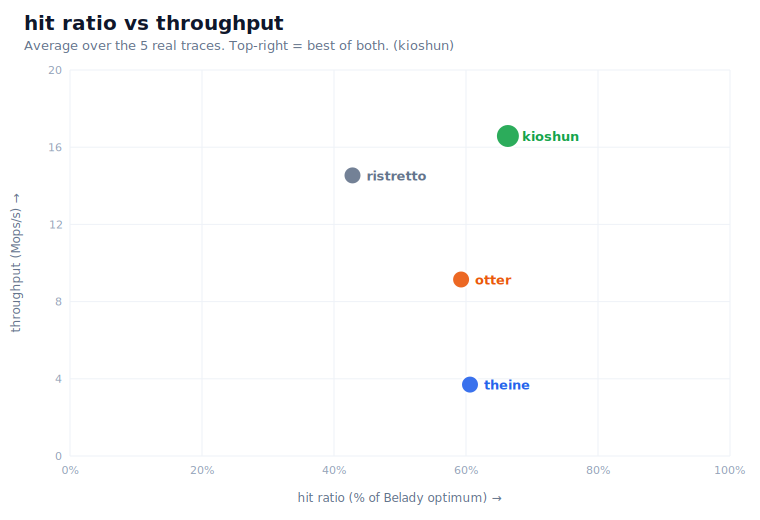

<div align="center">
  

  # Kioshun - In-Memory Cache for Go

  *"kee-oh-shoon" /kiːoʊʃuːn/*

  [](https://golang.org)
  [](LICENSE)
  [](https://github.com/unkn0wn-root/kioshun/actions)


  *Fast, sharded in-memory cache for Go*
</div>

> [!WARNING]
> <b>v1</b> is a complete redesign, not a drop-in upgrade from earlier releases!
>
> The biggest change is that clustering has been removed - the old peer-to-peer features are no longer part of the project. The focus is now on continuously improving cache performance and correctness.
> The cache core was also rebuilt - `AdmissionLFU` default has been replaced by a self-adapting `SieveTinyLFU` with probation/main queues, ghost entries, TinyLFU sketching, adaptive segment sizing, lock-free bounded Sieve reads and queued/batched writes.
>
> Public APIs changed as part of the redesign, including `New` and `NewDefault` replacing `NewWithDefaults`, cache policy/config names changing and HTTP middleware moving to the `httpcache` package.

## Index

- [What is Kioshun?](#what-is-kioshun)
- [Internals](INTERNALS.md)
- [Installation](#installation)
- [Quick Start](#quick-start)
- [Configuration](#configuration)
- [API](#api)
- [HTTP Middleware](MIDDLEWARE.md)
- [Benchmarks](#benchmarks)

## What is Kioshun?

Kioshun is a fast, sharded in-memory cache for Go.

If you want to know more about Kioshun internals and how it works under the hood - see [Kioshun Internals](INTERNALS.md)

## Installation

```bash
go get github.com/unkn0wn-root/kioshun
```

## Quick Start

```go
package main

import (
    "fmt"
    "time"

    "github.com/unkn0wn-root/kioshun"
)

func main() {
    // Create cache with default configuration
    c := kioshun.NewDefault[string, string]()
    defer c.Close()

    // Set with default TTL (30 min)
    c.Set("user:123", "David", kioshun.DefaultExpiration)

    // Set commits the write before returning so the key is immediately readable.
    c.Set("user:456", "John", kioshun.NoExpiration)

    // SetAsync returns early. It may commit inline when the shard is idle
    // otherwise it queues the write for that shard's worker.
    c.SetAsync("user:789", "Paul", 5*time.Minute)

    // Optional: call Sync() when committed visibility is required.
    c.Sync()

    // Get value
    if value, found := c.Get("user:123"); found {
        fmt.Printf("User: %s\n", value)
    }

}
```

## Configuration

### Basic

```go
config := kioshun.Config{
    MaxSize:         100000,               // Maximum number of items
    MaxCost:         0,                    // Optional weighted capacity budget
    ShardCount:      16,                   // Number of shards (0 = auto-detect)
    CleanupInterval: 5 * time.Minute,      // Cleanup frequency
    DefaultTTL:      30 * time.Minute,     // Default expiration time
    EvictionPolicy:  kioshun.SieveTinyLFU, // Eviction algorithm (default)
    // StatsEnabled records cache activity metrics such as hits, misses and
    // evictions. Tracking those counters adds runtime cost so enable it only
    // if you can accept runtime performance tradeoff.
    StatsEnabled:    true,
    WriteBufferSize: 1024,                 // Per-shard async write queue
    WriteBatchSize:  64,                   // Max commands applied per worker batch
}

c, err := kioshun.New[string, any](config)
if err != nil {
    // handle error
}
```

> Each cache runs one write-worker goroutine per shard (plus a cleanup goroutine when `CleanupInterval > 0`),
> so `ShardCount` sets the number of background goroutines - default `min(NumCPU*4, 256)`.
> If you create many caches (e.g. via the cache `Manager`), set `ShardCount` explicitly to bound the total.

### Weighted Capacity

`MaxSize` limits resident entry count. `MaxCost` optionally adds a weighted
resident budget. Without a custom weigher every entry costs `1`; with
`WithWeigher`, the cache can enforce byte-like or domain-specific weights.

```go
config := kioshun.DefaultConfig()
config.MaxSize = 100000
config.MaxCost = 256 << 20
config.CostAdmission = kioshun.CostAdmissionBalanced

c, err := kioshun.New[string, []byte](config, kioshun.WithWeigher(
    func(_ string, value []byte) int64 {
        return int64(len(value))
    },
))
```

`CostAdmissionFrequency` preserves TinyLFU frequency admission. For weighted
SieveTinyLFU caches, `CostAdmissionBalanced` compares frequency divided by
sqrt(cost), while `CostAdmissionDensity` compares frequency divided by cost.
Use the balanced mode when request hit ratio and byte pressure both matter.

## API

```go
c.Set(key, value, ttl time.Duration) error
c.SetAsync(key, value, ttl time.Duration) error
c.SetWithCallback(key, value, ttl, callback func(key, value)) error
c.Get(key) (value, found bool)
c.GetWithTTL(key) (value, ttl time.Duration, found bool)
c.Keys() []K
c.Clear()
c.Sync() error
c.Delete(key) bool
c.Exists(key) bool
c.Size() int64
c.Stats() Stats
c.PolicyStats() PolicyStats
c.Cleanup()
c.Close() error
```

> `Set` is synchronous and gives immediate read-after-write visibility for the key.
> `SetAsync` is optional. A nil error means the write was accepted - it may have
> committed inline already or it may still be queued. Use `Sync` when committed
> visibility is required.

> Create with `kioshun.New(config, kioshun.WithOnRemove(func(key K, value V, reason kioshun.RemovalReason) { ... }))`
> to receive a callback for every key removed by capacity eviction,
> SieveTinyLFU admission rejection, TTL expiration or `Delete`. Use
> `WithOnEvict(func(key K, value V) { ... })` for capacity evictions only.

### Statistics

```go
type Stats struct {
    Hits        int64
    Misses      int64
    Evictions   int64
    Expirations int64
    Size        int64
    Cost        int64
    Capacity    int64
    MaxCost     int64
    HitRatio    float64
    Shards      int
}

type PolicyStats struct {
    Admits              int64
    Rejects             int64
    GhostHits           int64
    Promotions          int64
    ProbationEvictions  int64
    MainEvictions       int64
}
```

## HTTP Middleware

Kioshun provides HTTP middleware out-of-the-box.

```go
import "github.com/unkn0wn-root/kioshun/httpcache"

config := httpcache.DefaultConfig()
config.DefaultTTL = 5 * time.Minute
config.MaxSize = 100000

middleware, err := httpcache.New(config)
if err != nil {
    // handle error
}
defer middleware.Close()

http.Handle("/api/users", middleware.Wrap(usersHandler))
```
> See **[MIDDLEWARE.md](MIDDLEWARE.md)** for complete documentation.

## Benchmarks

### Hit ratio and throughput

Kioshun is compared against [Ristretto](https://github.com/dgraph-io/ristretto),
[Otter](https://github.com/maypok86/otter) and [Theine](https://github.com/Yiling-J/theine-go)
by replaying ARC and LIRS request traces (P3, P8, S3, DS1, OLTP, LOOP)
through every cache in the **same harness** at a 100,000 entry cap. Hit ratio is
plotted as a percentage of the Belady optimum.









### Microbenchmarks

A separate suite compares Kioshun with Ristretto, BigCache, FreeCache and go-cache using
pre-generated workloads with async and strict write modes reported separately:

```bash
cd benchmarks
go test -run=TestBenchmarkComparisonGetSetup -count=1 .
go test -bench='BenchmarkCacheComparison' -benchmem -run=^$ -benchtime=1s .
go test -bench=. -benchmem -run=^$ -benchtime=1s -timeout=30m .
```
